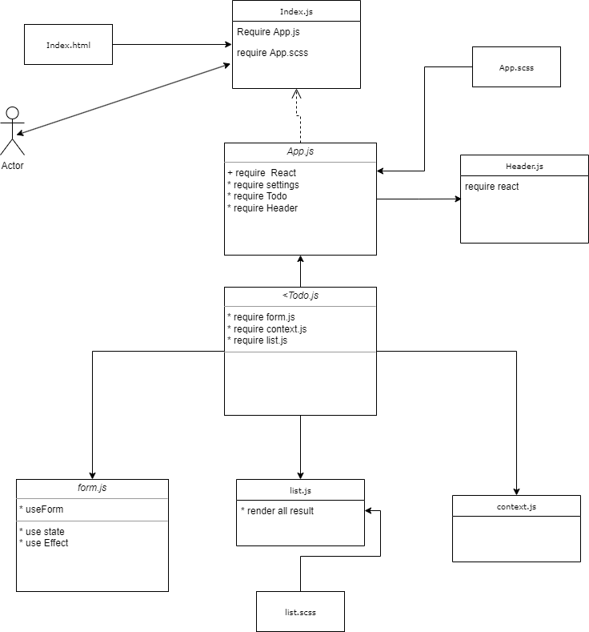

# todo-app

## * this is the link for netlify [netlify link](https://6307cbf9c6fd06007e54d385--precious-sprinkles-849636.netlify.app/)

* lets start with UML diagram 

* in the first phase of the lap I got some result but it is not soo good 

.png)

.png)

.png)

* on the Auth phase I add the login form 
.png)